# Inspección del Stack Frame con GDB

## Objetivo

Verificar empíricamente que el paso de parámetros por stack funciona correctamente.

---

## Compilación del ejecutable de prueba

A diferencia de la shared library, acá se compila un ejecutable normal (sin `-shared` ni `-fPIC`),
usando los `.o` ya generados:

```bash
gcc -g3 -o test_gini gini_test.c gini.o gini_asm.o
```

Iniciar GDB:

```bash
gdb ./test_gini
```

---

## Sesión completa de GDB

### Configuración inicial — breakpoints

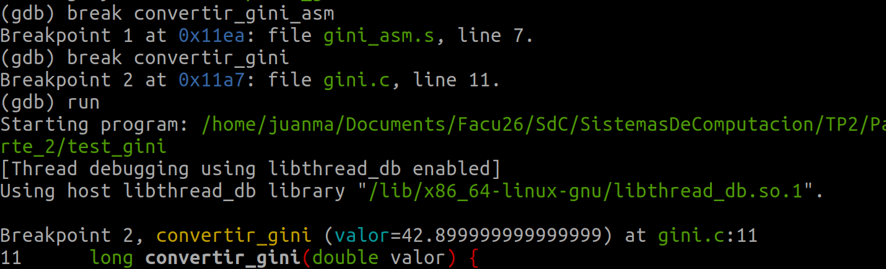

---

## MOMENTO 1 — Entrada a `convertir_gini` (capa C)

Parados en la entrada de la función C, antes de que se pushee el argumento al stack.

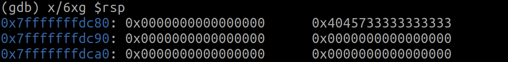

`0x4045733333333333` es la representación IEEE 754 del double `42.9`. Ya está en el stack
porque GCC lo puso ahí como parte del frame de `main_test.c`.

Continuar hasta el breakpoint en el ASM:

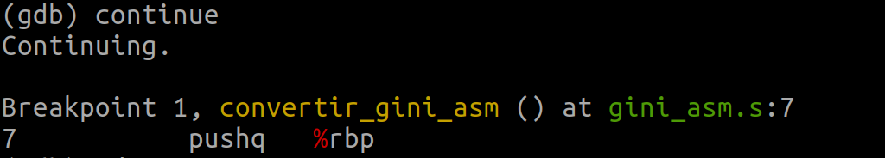
---

## MOMENTO 2 — Dentro de `convertir_gini_asm`

### 2a — Antes del prólogo (primera instrucción del ASM)

El `call` ya ejecutó: empujó la dirección de retorno al stack y saltó a `convertir_gini_asm`.
El `pushq %rbp` todavía **no** ejecutó.

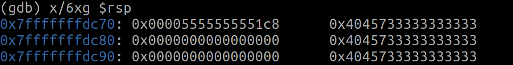

- `0x7fffffffdc70` → `0x00005555555551c8` — **dirección de retorno** a `convertir_gini`, puesta por `call`.
- `0x7fffffffdc78` → `0x4045733333333333` — **el double 42.9** pusheado por `gini.c`.

### 2b — Ejecutar `pushq %rbp`

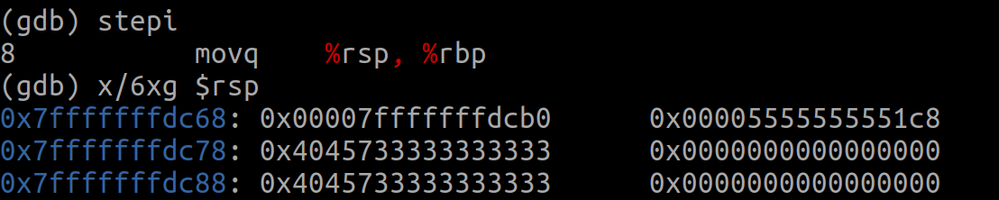

El `pushq %rbp` bajó `%rsp` 8 bytes y guardó el viejo `%rbp` de `convertir_gini`.

### 2c — Ejecutar `movq %rsp, %rbp` (prólogo completo)

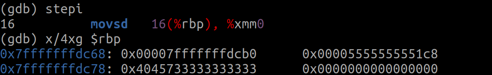

El prólogo está completo. El mapa del stack coincide exactamente con la teoría:

```
 0(%rbp) = 0x00007fffffffdcb0  ← viejo %rbp de convertir_gini  (guardado en el prólogo)
 8(%rbp) = 0x00005555555551c8  ← dirección de retorno a C       (puesta por 'call')
16(%rbp) = 0x4045733333333333  ← el double 42.9 en IEEE 754     (pusheado por gini.c)
```


### 2d — Ejecutar `movsd 16(%rbp), %xmm0`

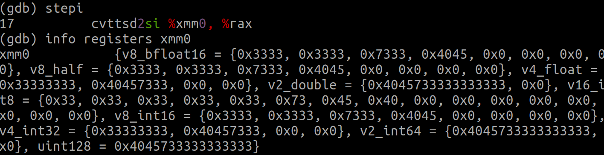

`xmm0` cargó correctamente el double `42.9` desde `16(%rbp)`.

### 2e — Ejecutar `cvttsd2si %xmm0, %rax`

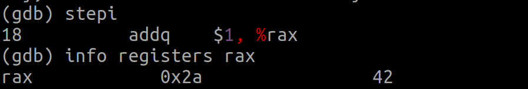

`0x2a` = 42 en decimal. La conversión truncó correctamente 42.9 → 42.

### 2f — Ejecutar `addq $1, %rax`


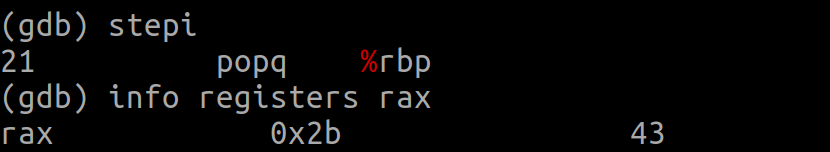

`0x2b` = 43. La suma `+1` funcionó correctamente.

### 2g — Ejecutar `popq %rbp` y verificar antes del `ret`

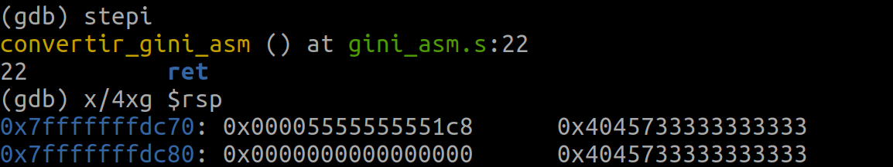

`%rsp` apunta a `0x00005555555551c8` — la dirección de retorno. El `ret` va a leerla y saltar ahí.

---

## MOMENTO 3 — Después del `ret`, de vuelta en C

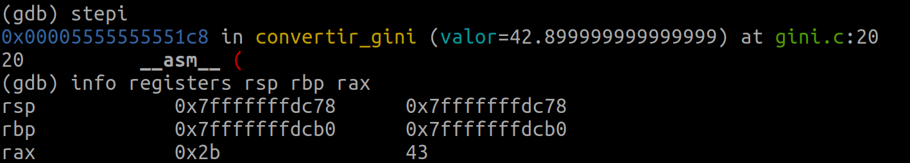

- `%rax = 43` — resultado correcto viajando de vuelta a C en el registro de retorno.
- `%rbp = 0x7fffffffdcb0` — restaurado al frame de `convertir_gini`, intacto.
- `%rsp = 0x7fffffffdc78` — stack balanceado, volvió exactamente al punto previo al `call`.

---