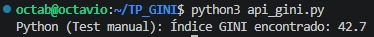

# Sistemas de Computación - Trabajo Práctico N° 2

Este proyecto es una implementación práctica que demuestra la integración de tres capas de abstracción en el desarrollo de software (Alto Nivel, Nivel Intermedio y Bajo Nivel) mediante la obtención y procesamiento del Índice GINI de Argentina.

**Nombres**  
_Baccino, Luca; Painenao, Juan Manuel; Alejandro R. Stangaferro;_  
**Claude's Interns**

**Facultad de Ciencias Exactas, Físicas y Naturales**  
**Sistemas de Computación**
**Profesores**
_Javier A. Jorge; Miguel A. Solinas;_
**2026**

## Descripción del Proyecto

El sistema está diseñado en tres capas distintas que interactúan entre sí utilizando las convenciones de llamadas de Linux x86-64:

1. **Capa Superior (Python):** Se encarga de la comunicación web. Consume la API pública del Banco Mundial para buscar el índice GINI más reciente de Argentina.
2. **Capa Intermedia (C):** Actúa como *wrapper*. Ejecuta el script de Python, captura el valor de coma flotante, lo convierte a un número entero y prepara el entorno para invocar al hardware.
3. **Capa Inferior (Ensamblador x86-64):** Recibe el dato entero e incrementa su valor en 1. Para forzar el uso de la memoria (Pila/Stack) y demostrar el manejo del *Stack Frame*, la rutina en C pasa 6 argumentos basura en los registros para que el valor real viaje obligatoriamente como el 7mo argumento a través de la pila.

---

## Requisitos Previos

Para compilar y ejecutar este proyecto, es necesario contar con las siguientes herramientas instaladas:

* **Python 3** y la librería `requests` (`sudo apt install python3-requests`)
* **GCC** con soporte multilib (`sudo apt install build-essential gcc-multilib g++-multilib`)
* **GDB** para la depuración y análisis de memoria (`sudo apt install gdb`)

---

## Compilación y Ejecución Paso a Paso

El desarrollo y prueba de este sistema se dividió en iteraciones para validar cada capa arquitectónica. A continuación, se detalla cómo ejecutar cada parte:

### Iteración 1: Validación de la Capa Superior (API REST)
Antes de compilar el sistema completo, se puede verificar que la conexión con el Banco Mundial esté operativa ejecutando el script de Python de forma aislada.

1. Ejecutar en la terminal:
   ```bash
   python3 api_gini.py
   ```
   
   Resultado

   
