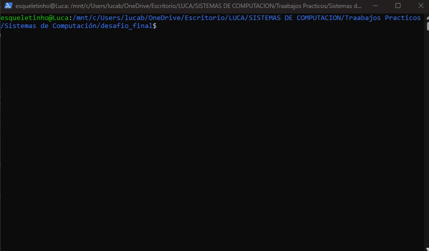

# Sistemas de Computacion
## TP3 - Modo real vs modo protegido


### Creacion de una imagen booteable

Crear imagen booteable simple:
```
printf '\364%509s\125\252' > main.img
```

Correr la imagen en Quemu. Quemu es un emulador y virtualizador de hardware de codigo abierto. Como emulador traduce instrucciones de una arquitectura a otra y como virtualizador, cuando la arquitectura coincide con la del host puede usar aceleracion por hardware.

Instalacion de Quemu:

```
sudo apt install qemu-system-x86
```

El comando:
```
qemu-system-x86_64 --drive file=main.img,format=raw,index=0,media=disk
```
Crea una PC virtual completa y arranca la imagen como lo haria hardware real.

#### Gif con todo el proceso


La maquina donde se realizo esta consigna no cuenta con el modo CSM (Compatibility Support Module), lo que imposibilita poder seguir arrancando cosas legacy/MBR. Por ende el pendrive no aparece entre las opciones de arranque.

### UEFI y Coreboot

### ¿Qué es UEFI? ¿como puedo usarlo? Mencionar además una función a la que podría llamar usando esa dinámica.  
UEFI (Unified Extensible Firmware Interface) es el reemplazo moderno del antiguo BIOS (Basic Input/Output System), que era el sistema de firmware que arrancaba computadoras, desarrolado por Intel. UEFI ofrece una interfaz estandar entre el sistema operativo y el firmware de la maquina. 
A diferencia de la BIOS que era basica y corria en modo real de 16 bits, lo que significaba que tenia accesos a solo 1MiB de memoria, UEFI pasa inmediatamente a modo protegido de 32 o 64 bits con acceso a espacio de memoria de 4GiB en 32 bits y 16EiB en 64, lo que le permite el acceso total a la memoria RAM desde el arranque.
La BIOS permitia hasta 4 particiones primarias y discos de 2TiB mientras que UEFI usa GPT (GUID Partition Table) que soporta hasta 128 particiones y 9.4 ZiB de capacidad de discos.
La UEFI implementa tambien un sistema de verificacion criptografica donde el firmware solo ejecuta bootloaders firmados con claves autorizadas (Secure Boot).
El CSM es un componente adicional que traen algunas EUFI para emular una bios tradicional y poder ejecutar imagenes MBR legacy.

Para poder usar UEFI se debe: crear un programa en c, compilarlo con las librerias UEFI que proporcionan los headers con las definiciones de los protocolos y servicios y generar un ejecutable .efi. Luego se coloca ese archivo en la EFI system partition y el firmware lo encuentra y lo ejecuta al arrancar.

Ejemplos de funciones:
- Boot Services: disponibles solo durante el arranque. Incluyen funciones para gestionar memoria, cargar imágenes ejecutables, manejar eventos y timers, y acceder a protocolos de dispositivos.

### ¿Menciona casos de bugs de UEFI que puedan ser explotados?

- Caso LogoFAIL: un bug que podia ser explotado para entregar un payload malicioso y eludir seguridad como Secure Boot, Intel Boot Guard, entre otras. Ademas, estas vulnerabilidades facilitaban la entrega de malware persistente a sistemas comprometidos durante la fase de arranque , al inyectar un archivo de imagen de logo malicioso en la particion del sistema EFI.

### ¿Qué es Converged Security and Management Engine (CSME), the Intel Management Engine BIOS Extension (Intel MEBx).?

CSME

CSME surge en 2017/2028 como renombre de loq ue era ME (Intel Management Engine) un subsistemadesarrollado en 2006. El CSME es un microcontrolador independiente que se encuentra en el chipset y cuenta con microprocesador propio, tiene su propia ram y corre su propio sistema operativo. Funciona completamente independiente de la CPU principal, funciona siempre que la placa madre tenga tension, incluso cuando el SO esta apagado o la maquina en estado de suspension.
Las principales funciones de CSME son:
- Seguridad del firmware: es el primer codigo que se ejecuta cuando se energiza la placa madre, verifica la integridad criptografica de la UEFI
- Gestion remota: permite encender, apagar, reiniciar, acceder a la consola, redirigir el teclado y el video, o reinstalar el SO de forma remota.
- Boot guard: permite "quemar" en fusibles permanentes un hash del firmware legitimo, de modo que si alguien modifica la BIOS, el sistema no arranca.

Intel MEBx

Es la interfaz de configuracion del CSME durante el arranque del sistema, de manera similar  a como la UEFI/BIOS permite configurar parametros del hardware.
Desde el MEBx se puede:
- Habilitar o deshabilitar AMT
- COnfigurar credenciales de acceso remoto
- Configurar la interfaz de red que se usara para la gestion
- Establecer politicas de acceso
- Activar KVM (Keyboard Video Mouse) remoto por hardware

### ¿Qué es coreboot ? ¿Qué productos lo incorporan ?¿Cuales son las ventajas de su utilización?

Coreboot se diferencia de la BIOS/UEFI, ya que en lugar de ser un firmware monolitico que implementa toda una interfaz de compatibilidad con hardware antiguo, coreboot hace lo minimo indispensable en hardware y delega todo lo demas a un payload separado.
Los productos que lo incorporan son:
- Google chromebooks
- System 76: fabricante de laptops y workstations linux
- Purims: fabricante de laptops orientadas a privacidad
- Qemu: firmware de maquinas virtuales

Las ventajas de Coreboot son:
- Velcidad de arranque: Al no cargar decadas de compatibilidad legacy, coreboot puede inicializar el hardware y entregar control al SO en tiempos dramaticamente menores.
- Transparencia y auditabilidad: Es codigo abierto, cualquiera puede aauditar exactamente que hace el firmware.
- Menor superficie de ataque: Al tener lo minimo la superficie de ataque es menor
- Modularidad: La arquitectura payload permite adaptar el firmware
- Independencia del vendedor: Al no depender del codigo del propietario, se puede actualizar el firmaware de equipos que el fabricante ya no soporta.  


### Linker

### ¿Que es un linker? ¿que hace ? 

El linker es una herramienta que toma uno o mas archivos .o y los combina en un unico archivo. Resuelve referencias, cuando el codigo tiene una etiqueta como msg que aputana  un string , el ensamblador no sabe en que direccion de memoria va a quedar ese string. El linker asigna las direcciones definitivas a cada simbolo y parchea todas las intrucciones que los referencian con la direccion correcta.

### ¿Que es la dirección que aparece en el script del linker?¿Porqué es necesaria ?

La línea . = 0x7c00 establece el el contador de posición del linker en la dirección 0x7C00. Esto le dice al linker que el programa va a estar ubicado en esa dirección de memoria cuando se ejecute. Es necesaria porque la BIOS, al encontrar un MBR válido, siempre lo carga en la dirección 0x7C00 y salta ahí. Si el linker no supiera esto, calcularía las direcciones de las etiquetas (como msg) asumiendo que el programa empieza en 0, y todas las referencias a datos serían incorrectas cuando el código se ejecute realmente en 0x7C00.

### Compare la salida de objdump con hd, verifique donde fue colocado el programa dentro de la imagen. 

Salida con hd:


Salida con objdump:


El programa ejecutable ocupa los primeros 15 bytes de la imagen (posiciones 0x00 a 0x0E). Son las instrucciones mov, lods, or, je, int, jmp y hlt que conforman el loop de impresión. En hd se ven como bytes hexadecimales (be 0f 7c b4 0e ac 08 c0 74 04 cd 10 eb f7 f4), y en objdump se ven como instrucciones desensambladas.

### Grabar la imagen en un pendrive y probarla en una pc y subir una foto 


### ¿Para que se utiliza la opción --oformat binary en el linker?

Le dice al linker que genere un archivo binario plano (raw binary), sin ningún header ni metadata, solo los bytes del código y datos tal cual deben aparecer en memoria.


### Modo protegido
# Desafío final: Modo protegido

En esta sección se construye, desde cero y sin macros, un bootloader que pasa de modo real a modo protegido, se generan dos variantes del programa para responder las consignas del desafío y se verifica con `gdb` el comportamiento del procesador cuando se intenta escribir sobre un segmento de solo lectura.

Todo el código fuente y el Makefile están en esta misma carpeta (`desafio_final/`).

```
desafio_final/
├── boot_pm.s          # 1) pasaje a modo protegido (sin macros)
├── boot_segmentos.s   # 2) dos descriptores con bases distintas
├── boot_readonly.s    # 3) segmento de datos read-only + intento de escritura
├── linker.ld          # script del linker (carga en 0x7C00)
├── Makefile           # compila las 3 imagenes y las corre en QEMU
```

Para construir las tres imágenes:

```
make
```

Para correr cada una:

```
make run-pm
make run-segmentos
make run-readonly
make debug-readonly   # arranca QEMU detenido y esperando gdb en :1234
```


## 1. Crear un código assembler que pueda pasar a modo protegido (sin macros)

El archivo `boot_pm.s` es un MBR de 512 bytes (firma `0xAA55`) cargado por la BIOS en `0x7C00`. El procedimiento que sigue para pasar a modo protegido es el siguiente:

1. **`cli`** — se deshabilitan las interrupciones porque la IVT del modo real deja de ser válida apenas se activa el modo protegido y todavía no hay IDT.
2. **Habilitar la línea A20.** Se usa el _Fast A20 Gate_ del puerto `0x92`: se lee el valor actual, se setea el bit 1 y se vuelve a escribir. Sin A20, la línea 21 de direcciones queda forzada a 0 y no se puede direccionar más allá del primer MiB.
3. **Cargar la GDT con `lgdt`.** La GDT se define en la propia imagen del bootloader (sección `gdt_start … gdt_end`) y se le pasa a la CPU mediante una estructura de 6 bytes (`limit:word`, `base:long`).
4. **Activar el bit `PE` (bit 0) del registro `CR0`.** Eso es lo que cambia el modo del procesador.
5. **Far jump (`ljmp $0x08, $pm_start`).** Este salto es indispensable: al saltar lejos se carga `CS` con el selector `0x08` (índice 1 de la GDT) y se vacía la cola de prefetch para que las próximas instrucciones se decodifiquen como código de 32 bits.
6. **Cargar `DS`, `ES`, `FS`, `GS`, `SS` con el selector `0x10`.** Después de eso ya estamos en modo protegido pleno y se inicializa el stack.
7. **Imprimir el mensaje en la VGA.** En modo protegido ya no se puede usar `int 0x10`, así que se escribe directamente en el framebuffer de texto en `0xB8000` (cada celda son dos bytes: carácter + atributo de color).

Fragmento clave (extraído de `boot_pm.s`):

```asm
.code16
_start:
    cli
    inb     $0x92, %al
    orb     $0x02, %al
    outb    %al, $0x92         # A20 habilitada
    lgdt    gdt_descriptor      # GDT cargada
    movl    %cr0, %eax
    orl     $0x1, %eax
    movl    %eax, %cr0          # PE = 1
    ljmp    $0x08, $pm_start    # far jump a 32 bits
.code32
pm_start:
    movw    $0x10, %ax
    movw    %ax, %ds
    movw    %ax, %es
    movw    %ax, %fs
    movw    %ax, %gs
    movw    %ax, %ss
    movl    $0x90000, %esp
```

La GDT es la mínima imprescindible: descriptor null (obligatorio), descriptor de código `0x9A / 0xCF` y descriptor de datos `0x92 / 0xCF`, ambos con base 0 y límite 4 GiB (granularidad 4 KiB).

```asm
gdt_start:
    .quad   0
    # Codigo - access 0x9A, flags 0xCF
    .word 0xFFFF; .word 0x0000; .byte 0x00; .byte 0x9A; .byte 0xCF; .byte 0x00
    # Datos  - access 0x92, flags 0xCF
    .word 0xFFFF; .word 0x0000; .byte 0x00; .byte 0x92; .byte 0xCF; .byte 0x00
gdt_end:
gdt_descriptor:
    .word gdt_end - gdt_start - 1
    .long gdt_start
```

Compilación y ejecución:

```
as --32 boot_pm.s -o boot_pm.o
ld -m elf_i386 -T linker.ld --oformat binary boot_pm.o -o boot_pm.bin
qemu-system-x86_64 -drive file=boot_pm.bin,format=raw,index=0,media=disk
```


En pantalla aparece `MODO PROTEGIDO OK - Hola desde 32 bits` impreso directamente sobre el framebuffer VGA, lo que confirma que el procesador está ejecutando código de 32 bits con la GDT activa.

## 2. Programa con dos descriptores en espacios de memoria diferenciados

`boot_segmentos.s` extiende el caso anterior eligiendo **bases distintas** para el descriptor de código y el de datos:

| Selector | Tipo   | Base       | Límite       |
| :------: | :----: | :--------: | :----------: |
|  `0x08`  | Código | `0x00000000` | 4 GiB (G=1)  |
|  `0x10`  | Datos  | `0x00010000` | 4 GiB (G=1)  |

El descriptor de datos en la GDT queda así (notar el byte `base[16:23] = 0x01`):

```asm
# Datos: base = 0x00010000
.word   0xFFFF
.word   0x0000
.byte   0x01            # <-- base[16:23] = 0x01  =>  base = 0x00010000
.byte   0x92
.byte   0xCF
.byte   0x00
```

Como las bases son diferentes, el offset 0 visto desde `DS` ya **no** apunta al mismo byte físico que el offset 0 visto desde `CS`:

- `CS:0x0000` → dirección física `0x00000000` (donde arranca la memoria)
- `DS:0x0000` → dirección física `0x00010000` (a 64 KiB del inicio)

Para que se pueda leer el mensaje desde el offset 0 de `DS`, el bootloader copia la cadena en modo real desde su lugar dentro de la imagen (cargada en `0x7C00`) hacia la dirección física `0x10000`, usando `rep movsb` con `ES = 0x1000` y `DI = 0`:

```asm
movw    $0x1000, %ax
movw    %ax, %es
movw    $msg_data, %si      # origen
xorw    %di, %di            # destino offset 0 en ES => fisica 0x10000
movw    $msg_len, %cx
cld
rep movsb
```

Ya en modo protegido, lectura y escritura usan **el mismo `DS`** pero con offsets distintos:

```asm
xorl    %esi, %esi          # DS:0       => fisica 0x10000  (mensaje)
movl    $0xA8000, %edi      # DS:0xA8000 => fisica 0xB8000  (VGA)
```

`0xA8000 = 0xB8000 − 0x10000`, es decir, el offset dentro del segmento de datos para alcanzar el framebuffer de la VGA cuando la base de `DS` es `0x10000`. Eso muestra de manera explícita que código y datos viven en _espacios lógicos_ diferentes: aunque la memoria física es la misma, cada selector tiene su propia "ventana" sobre ella.

Si se escribe `mov $0, %esi` desde código que pensara estar en CS:0, leería el primer byte del bootloader; en cambio, al estar leyendo desde DS:0, lee el mensaje copiado a `0x10000`. Es exactamente el caso de "espacios de memoria diferenciados".


El GIF muestra que boot_pm.bin y boot_segmentos.bin se diferencian en un único byte: el quinto byte del descriptor de datos, que codifica base[16:23]. En boot_pm.bin ese byte es 0x00 (segmento de datos con base 0x00000000); en boot_segmentos.bin es 0x01 (segmento de datos con base 0x00010000). Esa diferencia es lo que vuelve "diferenciados" los espacios de memoria de código y datos: aunque ambos selectores apuntan a la misma RAM física, el offset 0 visto desde DS es la dirección física 0x10000, mientras que el offset 0 visto desde CS sigue siendo 0x00000000. El mensaje se copia con rep movsb a 0x10000 en modo real, y en modo protegido se lee con mov (%esi), %al desde DS:0.

## 3. Segmento de datos de solo lectura — qué pasa al escribir

`boot_readonly.s` es idéntico a `boot_pm.s` salvo por **un único bit** en el descriptor de datos:

```asm
# Datos READ-ONLY:  access = 0x90 = 1 00 1 0000
#   P=1 DPL=00 S=1 E=0(datos) DC=0 W=0(NO escribible) A=0
.byte   0x90        # antes era 0x92
```

El bit relevante es el bit 1 del byte de access (`W` para descriptores de datos). En `0x92` está en 1 (escribible), en `0x90` está en 0 (solo lectura).

### ¿Qué sucede al intentar escribir?

El programa, después de pasar a modo protegido, primero escribe `RO` en la VGA usando un `EDI = 0xB8000` (eso funciona porque `DS` cubre toda la memoria), y a continuación intenta escribir un byte con:

```asm
movb    $0xFF, (%edi)
```

Sobre el segmento `DS` cuyo descriptor está marcado como _read-only_. Esa escritura genera una **#GP — General Protection Fault (vector 13)**: la unidad de protección del procesador detecta que el descriptor no permite escritura y aborta la instrucción antes de modificar memoria.

### ¿Qué debería suceder a continuación?

Lo que el procesador hace ante una `#GP` está descripto en el manual de Intel (vol. 3, _Interrupt and Exception Handling_). El flujo "normal" es:

1. La CPU consulta la **IDT** (Interrupt Descriptor Table) en la entrada 13.
2. Encuentra un _gate_ válido que describe el handler de `#GP`.
3. Salta al handler con un código de error en la pila y deja que el sistema operativo decida qué hacer (usualmente terminar el proceso).

En nuestro caso **nunca cargamos una IDT**, así que el procesador no encuentra el gate de `#GP` y eleva la falla:

1. `#GP` no manejada → la CPU intenta entrar a `#DF` (_Double Fault_, vector 8).
2. Tampoco hay handler para `#DF` → **triple fault**.
3. Un triple fault provoca el **reset del procesador**, que reinicia toda la máquina.

En QEMU el efecto visible es que la VM se reinicia (o se cierra, si se la corre con `-no-reboot`).

### Verificación con `gdb`

Para verlo en vivo se compila y se arranca QEMU detenido con el stub de gdb activado:

```
make debug-readonly
# en otra terminal
gdb -ex "target remote :1234" -ex "set architecture i8086"
```

Dentro de gdb:

```
(gdb) b *0x7C00              # primer byte del bootloader
(gdb) c                       # ejecuta hasta ahi
(gdb) display/i $pc           # muestra la instruccion actual cada step
(gdb) si                      # ir paso a paso
... avanzar hasta despues del ljmp ...
(gdb) set architecture i386   # ya estamos en 32 bits
(gdb) si                      # seguir hasta la instruccion movb $0xFF,(%edi)
(gdb) si                      # ESTA es la que dispara #GP
```

Adicionalmente, si se corrió QEMU con `-d int,cpu_reset` (lo hace el target `run-readonly` del Makefile), por la salida de QEMU aparecen dos eventos consecutivos:

```
check_exception old: 0xffffffff new 0xd     <- #GP, vector 13
...
check_exception old: 0xd new 0x8            <- #DF, vector 8
...
CPU Reset (CPU 0)                            <- triple fault
```


En el GIF se ven simultáneamente las tres ventanas:

- **Terminal de la izquierda — gdb**: se conecta a QEMU con
  `target remote :1234`, pone un breakpoint en `0x7c00` (primer byte del
  bootloader) y avanza con `si` instrucción por instrucción. Pasa por la
  habilitación de A20, la carga de la GDT, la activación del bit PE de CR0
  y el `ljmp` que entra a 32 bits. Una vez en modo protegido, el `EIP` llega
  a `0x7c27`, donde está la instrucción `mov %eax, %ss`.

- **Terminal de la derecha — log de QEMU** (con `-d int,cpu_reset`): muestra el
  dump de la CPU justo después del fallo. En la línea de los selectores se
  ven los atributos de cada segmento:
  
```
CS =0008 ... DPL=0 CS32 [-R-]
DS =0010 ... DPL=0 DS   [--A]   <-- sin W: read-only
SS =0000 ... DPL=0 DS16 [-WA]
```

  El descriptor de datos quedó marcado como solo lectura (access byte
  `0x90`), y eso se ve reflejado en los flags `[--A]` (sin `W`).

- **Ventana de QEMU [Paused]**: la VM queda congelada porque corremos
  con `-no-reboot -no-shutdown`. Sin esa opción, el procesador se
  reiniciaría solo y volveríamos a ver SeaBIOS arrancando.

#### Por qué el fault ocurre en `mov %eax, %ss`

El intento de escritura explícita que está más adelante en el código
(`movb $0xFF, (%edi)`) **nunca llega a ejecutarse**: el procesador detecta
una violación de protección antes, en la propia carga de SS. La regla del
modo protegido dice que **SS solo puede cargarse con un selector que apunte
a un segmento de datos escribible**. Como el descriptor 0x10 tiene `RW=0`,
apenas se ejecuta `mov %eax, %ss` la CPU dispara `#GP`. Es la primera
instrucción que toca el segmento de datos read-only para escribir, y la
unidad de protección la corta en seco.

#### Cadena `#GP → #DF → triple fault`

El log de QEMU muestra la secuencia exacta `#GP → #DF → triple fault`:
```
check_exception old: 0xffffffff new 0xd     <- #GP (vector 13)
check_exception old: 0xd       new 0xd     <- otra #GP al buscar handler
check_exception old: 0x8       new 0xd     <- al pasar a #DF, otra #GP
Triple fault
```

1. Se levanta `#GP` (vector `0xd`) por la carga ilegal de SS.
2. Como nunca cargamos una IDT, el procesador no encuentra el descriptor
   del handler de `#GP` y vuelve a generar `#GP` al intentar leerlo.
3. Eso escala a `#DF` (vector `0x8`, _Double Fault_), pero el handler de
   `#DF` tampoco existe → `#GP` otra vez.
4. La tercera excepción seguida es lo que se define como **triple
   fault**, y la única reacción posible del procesador es resetearse.
   Con `-no-reboot` QEMU detiene la VM en lugar de reiniciar, y por eso
   el título de la ventana dice `[Paused]`.

Cambiar un único bit del descriptor de datos (el bit `RW`, pasando el
access byte de `0x92` a `0x90`) fue suficiente para activar todo el
mecanismo de protección y llevar al procesador hasta el reset.

## 4. ¿Con qué valor se cargan los registros de segmento en modo protegido? ¿Por qué?

Se cargan con un **selector** de 16 bits, no con una dirección base. El formato del selector es:

```
 15                                3   2   1   0
+-----------------------------------+---+-------+
|              índice               | TI|  RPL  |
+-----------------------------------+---+-------+
```

- **Índice (bits 15..3):** posición del descriptor dentro de la tabla (8 bytes por entrada).
- **TI (bit 2):** _Table Indicator_. `0` = GDT, `1` = LDT.
- **RPL (bits 1..0):** _Requested Privilege Level_ (0 = ring 0, 3 = ring 3).

En los programas de este desafío los selectores son:

| Registro | Valor   | Significado                                              |
| :------: | :-----: | -------------------------------------------------------- |
| `CS`     | `0x08`  | índice 1 (segmento de código), TI=0 (GDT), RPL=0         |
| `DS/ES/SS/FS/GS` | `0x10` | índice 2 (segmento de datos), TI=0 (GDT), RPL=0   |

**¿Por qué un selector y no una base?** Porque la lógica de protección del 80386 hacia adelante separó *qué* segmento se usa (selector, visible al programador) de *cómo* es ese segmento (descriptor, almacenado en la GDT/LDT, controlado por el sistema operativo). El descriptor contiene la base, el límite, el nivel de privilegio, el tipo (código/datos), si es leíble/escribible/ejecutable, etc. Cuando el procesador carga un selector en un registro de segmento, internamente lee el descriptor referenciado y guarda toda esa información en una **shadow register** invisible para el programador. Las accesos siguientes usan esa caché, sin volver a consultar la tabla.

Esta indirección permite tres cosas que el modo real no podía dar:

- **Protección:** el código de usuario solo puede usar selectores que el SO le habilitó; si intenta cargar uno con un RPL inferior al CPL actual, la CPU dispara `#GP`.
- **Aislamiento:** dos procesos pueden tener LDTs distintas y compartir la GDT, viendo "su propia" memoria sin pisar al otro.
- **Atributos por segmento:** marcar un segmento como solo lectura, ejecutable, sistema, conformante, etc., como vimos con el descriptor `0x90` del punto 3.

En resumen, los registros de segmento dejan de ser punteros directos para convertirse en *handles* a entradas de una tabla controlada por el sistema, y por eso lo que se les escribe son selectores con la forma `índice·8 + TI·4 + RPL`.

### Bibliografia
- https://www.lenovo.com/ar/es/glosario/uefi/?orgRef=https%253A%252F%252Fwww.google.com%252F&srsltid=AfmBOoqRwmyjiC2P8mG_-BWqRwpSsGSIz4byrFluFUqVfA7tWc6FsPN8
- https://unaaldia.hispasec.com/2023/12/vulnerabilidades-criticas-en-uefi-logofail-expone-a-dispositivos-x86-y-arm.html
