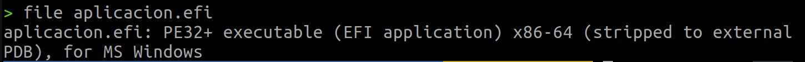
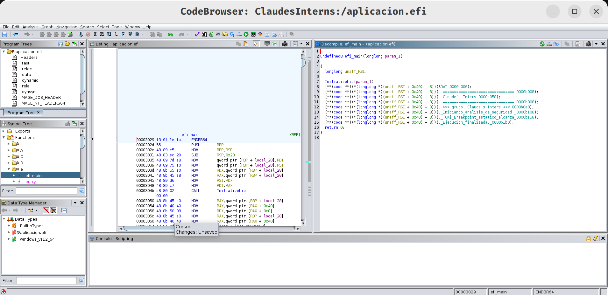

# Trabajo Práctico 1 — Exploración del entorno UEFI y la Shell

**Objetivo:** explorar cómo UEFI abstrae el hardware y gestiona la configuración del sistema antes de cargar el sistema operativo, usando la UEFI Shell sobre QEMU + OVMF.

A diferencia del BIOS Legacy que simplemente leía el primer sector de un disco (MBR), UEFI es un entorno completo con su propio gestor de memoria, red y consola. 

---

## 1.1 Arranque en el entorno virtual

**Comando:**

```
qemu-system-x86_64 -m 512 -bios /usr/share/ovmf/OVMF.fd -net none
```

- `-m 512`: asigna 512 MB de RAM a la VM.
- `-bios /usr/share/ovmf/OVMF.fd`: en lugar de la BIOS legacy de QEMU, carga el firmware UEFI provisto por el paquete `ovmf`.
- `-net none`: deshabilita la placa de red virtual (no la necesitamos para el TP)


---

## 1.2 Exploración de Dispositivos (Handles y Protocolos)

UEFI no usa letras de unidad fijas (como `C:` en Windows) ni interrupciones predefinidas (como `int 0x13` para disco en BIOS). En su lugar mantiene una base de datos interna de handles que agrupan protocolos.

### Comandos a ejecutar dentro de la UEFI Shell

```
Shell> map
Shell> FS0:
FS0:\> ls
FS0:\> exit             (volvemos al prompt Shell> )
Shell> dh -b
```

#### `map`

Lista los **mappings** entre nombres lógicos y los protocolos/dispositivos detectados. Si corremos este comando, vemos lo siguiente:


Las cadenas largas (`PciRoot(0x0)/Pci(...)/Ata(...)`) son **device paths**: una representación de cómo llegar al dispositivo desde la raíz del bus PCI.

#### `FS0:` y `ls`

`FS0:` cambia el "directorio actual" al primer file system detectado (típicamente la partición ESP de un disco real, o el ramdisk de OVMF en QEMU). `ls` lista los archivos y directorios.

En nuestro caso el comando `FS0:` muestra un error ya que no encuentra el system file.

#### `dh -b`

`dh` (= _dump handle_) lista todos los handles activos del sistema y los protocolos que cada uno implementa. La opción `-b` hace _break_ cada pantalla (hay decenas de handles, sin esto sale todo de corrido).

Corriendo esta linea de comando nos devuelve lo siguiente:


##### Cómo se lee cada línea

El formato es:

```
<numero_de_handle>: <protocolo_1>  <protocolo_2>  <protocolo_3> …
```

El número de la izquierda (`01:`, `02:`, `03:`, …) es el **ID del handle**. Todo lo que viene después son los **protocolos que ese handle implementa**, separados por espacios. Los protocolos pueden aparecer de tres formas:

1. **Nombre simbólico amigable** — como `LoadedImage`, `Decompress`, `FirmwareVolume2`, `SmartCardReader`. Son protocolos estándar de UEFI cuyo GUID está en el diccionario interno de la Shell, así que se traduce a un nombre legible.
2. **GUID crudo de 128 bits** — como `EE4E5898-3914-4259-9D6E-DC7BD79403CF`. El protocolo existe pero la Shell no tiene su nombre amigable cargado (típicamente protocolos vendor-specific o de revisiones nuevas).
3. **Nombre con paréntesis** — como `LoadedImage(DxeCore)` o `DevicePath(..F8EB-…))`. El paréntesis es **metadato extra del protocolo**, no otro protocolo. Por ejemplo `LoadedImage(DxeCore)` significa "este handle expone `LoadedImage`, y la imagen cargada se llama `DxeCore.efi`".

---

### Pregunta de Razonamiento 1

> Al ejecutar `map` y `dh`, vemos protocolos e identificadores en lugar de puertos de hardware fijos. ¿Cuál es la ventaja de seguridad y compatibilidad de este modelo frente al antiguo BIOS?

**Respuesta:**

En el modelo BIOS, el código que quería usar el hardware tenía dos caminos: o llamaba interrupciones predefinidas (`int 0x10` para video, `int 0x13` para disco) que asumían comportamientos fijos del firmware, o tocaba directamente puertos de I/O y direcciones de memoria conocidas (`0x3F8` para serie, `0xB8000` para texto VGA). Esto trajo dos problemas que UEFI resuelve con el modelo de handles + protocolos.

**Compatibilidad.** El BIOS fijaba la convención del PC IBM original: discos por `int 0x13`, hasta 4 particiones primarias, geometría CHS, MBR de 512 bytes, etc. Cuando aparecieron tecnologías nuevas (USB, SATA, NVMe, GPT, Secure Boot) la BIOS tuvo que ir parchando con módulos como CSM y limitaciones cada vez más artificiales. UEFI, en cambio, define una interfaz abstracta (el protocolo) y deja el cómo implementarla al driver del hardware concreto. Un disco SATA, uno NVMe y uno USB exponen el mismo `EFI_BLOCK_IO_PROTOCOL`: el bootloader y el SO los consumen igual sin saber qué hay debajo. Soportar un nuevo bus es escribir un driver que produzca ese protocolo, no rehacer la convención. 

**Seguridad.**
**No hay acceso directo al hardware.** Un programa UEFI no toca puertos: tiene que pedirle al firmware un handle y usar el protocolo. El firmware media todos los accesos y puede aplicar políticas (rechazar, auditar, etc.), esto facilita un desarrollo seguro y sin problemas con el hardware.

---

## 1.3 Análisis de Variables Globales (NVRAM)

La fase BDS (Boot Device Selection) decide qué cargar basándose en variables no volátiles.

### Comandos

```
Shell> dmpstore
Shell> set TestSeguridad "Hola UEFI"
Shell> set -v
```


#### `dmpstore`

Vuelca todas las variables UEFI accesibles desde la Shell.

Cada entrada de `dmpstore` muestra GUID + nombre + atributos + dump hexadecimal del contenido. Los `Boot####` son estructuras `EFI_LOAD_OPTION` que contienen la descripción legible y el device path del archivo `.efi` a ejecutar.

#### `set TestSeguridad "Hola UEFI"`

Crea una variable de la Shell llamada `TestSeguridad`. Es una variable temporal que vive solo mientras la Shell está corriendo. Se usa para mostrar cómo se manipulan variables desde la consola.

#### `set -v`

Lista todas las variables del entorno de la Shell (las creadas con `set`).

---

### Pregunta de Razonamiento 2

> Observando las variables `Boot####` y `BootOrder`, ¿cómo determina el Boot Manager la secuencia de arranque?

**Respuesta:**

El Boot Manager, en cada arranque, hace lo siguiente:

1. **Lee `BootOrder`** desde NVRAM.
2. **Itera** los IDs en ese orden.
3. Para cada ID, **lee la `Boot####`** correspondiente y resuelve el device path: el firmware recorre handles/protocolos para localizar el archivo ejecutable `.efi` indicado.
4. Si el archivo existe y supera Secure Boot (firma válida cuando está activado), **lo carga y ejecuta**. La entrada usada queda registrada en `BootCurrent`.
5. Si el archivo no se encuentra o falla, **pasa al siguiente ID** de `BootOrder`.

---

## 1.4 Footprinting de Memoria y Hardware

Antes de entregar el control al SO, el firmware ya descubrió todo el hardware y armó una "foto" del sistema. Esta sección consulta tres vistas de esa foto: el mapa de memoria, los dispositivos PCI y los drivers cargados.

### Comandos

```
Shell> memmap -b
Shell> pci -b
Shell> drivers -b
```

(`-b` hace pausa cada pantalla. La salida real es larga.)


---

### Pregunta de Razonamiento 3

> En el mapa de memoria (`memmap`), existen regiones marcadas como `RuntimeServicesCode`. ¿Por qué estas áreas son un objetivo principal para los desarrolladores de malware (Bootkits)?

**Respuesta:**

- **Runtime Services**: siguen disponibles después de `ExitBootServices`, durante toda la ejecución del SO.

El código que implementa esos Runtime Services vive precisamente en las regiones marcadas `RuntimeServicesCode` del `memmap`. El SO mapea esa memoria en su espacio virtual, y cuando necesita una de esas funciones, salta al firmware. Es decir: es código del firmware ejecutándose dentro del contexto del SO, con privilegio máximo, mientras el sistema está corriendo.

Eso lo vuelve un objetivo para los desarrolladores de malware:

1. **Persistencia inmune al disco.** El código de los Runtime Services se carga desde la SPI flash de la motherboard en cada arranque. Reformatear el disco, reinstalar Windows, cambiar la SSD: nada de eso lo borra. Solo borra el bootkit reflashear el firmware.
2. **Privilegio máximo y previo al SO.** Ejecuta antes que cualquier antivirus o EDR. Para el momento en que el SO terminó de cargar, el bootkit ya tomó las decisiones que quería tomar (ej. desactivar verificaciones, modificar el kernel en vuelo, plantar drivers).
3. **Invisibilidad para el SO.** Los antivirus convencionales escanean el disco y la RAM "de su lado"; muy pocos inspeccionan las páginas de `RuntimeServicesCode`, porque están marcadas como pertenecientes al firmware y son código que el SO no controla.
4. **Sobreviven a reinstalaciones del SO.** El bootkit modifica la imagen del firmware en SPI flash; en cada arranque siguiente, el firmware vuelve a copiarse a esas páginas de `RuntimeServicesCode` ya infectadas. El SO ve un sistema "limpio", pero el firmware no lo es.

#  Trabajo Práctico 2: Desarrollo, compilación y análisis de seguridad

## 2.1 Código Fuente

Archivo: aplicacion.c

```c
#include <efi.h>
#include <efilib.h>

EFI_STATUS efi_main(EFI_HANDLE ImageHandle, EFI_SYSTEM_TABLE *SystemTable)
{
    InitializeLib(ImageHandle, SystemTable);
    SystemTable->ConOut->OutputString(SystemTable->ConOut, L"\r\n");
    SystemTable->ConOut->OutputString(SystemTable->ConOut, L"=====================================\r\n");
    SystemTable->ConOut->OutputString(SystemTable->ConOut, L"        Claude's Inters              \r\n");
    SystemTable->ConOut->OutputString(SystemTable->ConOut, L"=====================================\r\n");
    SystemTable->ConOut->OutputString(SystemTable->ConOut, L"\r\n        >>> grupo: Claude's Inters <<<\r\n\r\n");
    SystemTable->ConOut->OutputString(SystemTable->ConOut, L"Iniciando analisis de seguridad...\r\n");

    unsigned char code[] = {0xCC};
    if (code[0] == 0xCC)
    {
        SystemTable->ConOut->OutputString(SystemTable->ConOut, L"[OK] Breakpoint estatico alcanzado (INT3)\r\n");
    }

    SystemTable->ConOut->OutputString(SystemTable->ConOut, L"\r\nEjecucion finalizada.\r\n");
    return EFI_SUCCESS;
}
```

### Pregunta 4 — ¿Por qué OutputString y no printf?

printf pertenece a la libc, que depende del sistema operativo para funcionar. En el entorno UEFI no existe SO, kernel ni syscalls. La única salida disponible es el protocolo ConOut de la EFI_SYSTEM_TABLE, cuya función OutputString es la interfaz de consola que provee el propio firmware. Además, UEFI trabaja con strings UTF-16 (de ahí el prefijo L""), mientras que printf espera ASCII/UTF-8.

---

## 2.2 Compilación — Tres Etapas

### Dependencias previas

```bash
sudo apt install gnu-efi binutils gcc
```

### Etapa 1 — Compilar a objeto ELF

```bash
gcc \
  -I/usr/include/efi \
  -I/usr/include/efi/x86_64 \
  -I/usr/include/efi/protocol \
  -fpic -ffreestanding -fno-stack-protector \
  -fno-strict-aliasing -fshort-wchar \
  -mno-red-zone -maccumulate-outgoing-args \
  -Wall -c -o aplicacion.o aplicacion.c
```

### Etapa 2 — Linkear a shared object

```bash
ld -shared -Bsymbolic \
  -L/usr/lib \
  -T /usr/lib/elf_x86_64_efi.lds \
  /usr/lib/crt0-efi-x86_64.o \
  aplicacion.o \
  -o aplicacion.so \
  -lefi -lgnuefi
```

El linker script elf_x86_64_efi.lds define el layout de secciones que luego objcopy necesita para construir el PE/COFF.

### Etapa 3 — Convertir a PE/COFF .efi

```bash
objcopy \
  -j .text -j .sdata -j .data \
  -j .dynamic -j .dynsym \
  -j .rel -j .rela \
  -j '.rel.*' -j '.rela.*' \
  -j .reloc \
  --target=efi-app-x86_64 \
  aplicacion.so aplicacion.efi
```

objcopy reempaqueta el shared object ELF extrayendo solo las secciones relevantes y convirtiéndolas al formato PE/COFF que UEFI puede ejecutar.

### Verificación

```bash
file aplicacion.efi
```

Salida:

---

## 2.3 Análisis de Metadatos y Decompilación

### Metadatos con readelf

```bash
readelf -h aplicacion.efi
```

Permite inspeccionar el encabezado del binario y confirmar arquitectura, tipo de ejecutable y punto de entrada.

### Análisis con Ghidra

Se importó aplicacion.efi en Ghidra (File → Import File). Ghidra detectó automáticamente el formato PE COFF. Tras el análisis automático, se navegó a la función efi_main desde el panel Symbol Tree → Functions.



#### Pseudocódigo generado por Ghidra

```c

undefined8 efi_main(longlong param_1)

{
  longlong unaff_RSI;
  
  InitializeLib(param_1);
  (**(code **)(*(longlong *)(unaff_RSI + 0x40) + 8))(&DAT_0000b000);
  (**(code **)(*(longlong *)(unaff_RSI + 0x40) + 8))(u_================================_0000b008);
  (**(code **)(*(longlong *)(unaff_RSI + 0x40) + 8))(u_Claude's_Inters_0000b058);
  (**(code **)(*(longlong *)(unaff_RSI + 0x40) + 8))(u_================================_0000b008);
  (**(code **)(*(longlong *)(unaff_RSI + 0x40) + 8))(u_>>>_grupo:_Claude's_Inters_<<<_0000b0a8);
  (**(code **)(*(longlong *)(unaff_RSI + 0x40) + 8))(u_Iniciando_analisis_de_seguridad._0000b108);
  (**(code **)(*(longlong *)(unaff_RSI + 0x40) + 8))(u_[OK]_Breakpoint_estatico_alcanza_0000b158);
  (**(code **)(*(longlong *)(unaff_RSI + 0x40) + 8))(u_Ejecucion_finalizada._0000b1b0);
  return 0;
}
```

#### Observaciones
 
Ghidra no conoce los tipos UEFI, por lo que EFI_STATUS aparece como undefined8 y EFI_SYSTEM_TABLE* como unaff_RSI (unaffected RSI). Cada llamada a OutputString se muestra como una indirección a través de offsets en crudo (0x40 para ConOut, +8 para OutputString) porque Ghidra no tiene las definiciones de structs de UEFI. El bloque if (code[0] == 0xCC) no aparece porque GCC lo eliminó en tiempo de compilación al detectar que la condición siempre es verdadera. Los strings "Claude's Inters" y ">>> grupo: Claude's Inters <<<" son visibles directamente en el pseudocódigo y en Window → Defined Strings.


---

### Pregunta 5 — ¿Por qué 0xCC aparece como -52 en Ghidra?

En este caso el if fue eliminado por GCC antes de llegar al binario, por lo que Ghidra no muestra la comparación. De haberla mostrado, 0xCC aparecería como -52 porque Ghidra infiere el tipo como signed char y aplica complemento a dos: el bit más significativo de 1100 1100 es 1, resultando en -(256 - 204) = -52. Esto importa en ciberseguridad porque 0xCC es el opcode de INT 3 (software breakpoint), y un analista que ve -52 puede no reconocerlo, pasando por alto breakpoints inyectados o mecanismos de anti-debugging en el firmware.

---

# TP3 — Ejecución de aplicación UEFI en Bare Metal

## Objetivo

Trasladar el binario `aplicacion.efi` (compilado en el TP2) desde el entorno de desarrollo a una computadora real (Lenovo ThinkPad T450), sorteando las restricciones impuestas por **Secure Boot** y ejecutando el binario directamente desde la **UEFI Shell**, fuera de cualquier sistema operativo.

---

## 1. Marco teórico

### 1.1 ¿Por qué Secure Boot bloquea nuestro binario?

Secure Boot es un mecanismo definido en la especificación UEFI que verifica, antes de transferir el control, que todo binario `.efi` cargado durante el arranque esté firmado digitalmente por una autoridad cuya clave pública resida en la base de datos `db` del firmware. Habitualmente esta base contiene certificados de **Microsoft** y del **OEM** (en este caso Lenovo).

Nuestros binarios no están en esa cadena de confianza:

- **`Shell.efi` de TianoCore**: distribuido por el proyecto EDK II como binario de desarrollo, no firmado por Microsoft.
- **`aplicacion.efi`**: compilado localmente en el TP2, sin firma alguna.

Si Secure Boot estuviera activo, el firmware respondería con `Security Violation` (`EFI_SECURITY_VIOLATION`, status code `0x800000000000001A`) y abortaría la carga.

### 1.2 ¿Por qué FAT32 en el USB?

La especificación UEFI (sección 13.3 — *File System Format*) exige que la **System Partition (ESP)** y todo medio de arranque removible utilicen el sistema de archivos **FAT** (FAT12/16/32). El firmware no incluye drivers para ext4, NTFS, exFAT u otros, por lo que cualquier otra opción resultaría invisible al gestor de arranque.

### 1.3 ¿Por qué la ruta `/EFI/BOOT/BOOTX64.EFI`?

Cuando un medio removible no posee una entrada NVRAM previa, el firmware busca un *fallback path* estandarizado en función de la arquitectura. Para x86_64 esa ruta es exactamente `\EFI\BOOT\BOOTX64.EFI`. Al colocar la Shell allí, garantizamos que el firmware la cargue automáticamente al seleccionar el USB en el boot menu.

---

## 2. Preparación del medio de arranque (USB)

### 2.1 Identificación del dispositivo

```bash
lsblk
```

> ⚠️ Se asume que el pendrive corresponde a `/dev/sdb1`. Ajustar en función del resultado de `lsblk`. **Verificar bien antes de formatear** — un error aquí destruye datos del disco principal.

### 2.2 Comandos ejecutados

```bash
# 1. Formatear el pendrive en FAT32 (requerimiento de UEFI)
sudo mkfs.vfat -F 32 /dev/sdb1

# 2. Montar el pendrive
sudo mount /dev/sdb1 /mnt

# 3. Crear la estructura estandarizada de directorios
sudo mkdir -p /mnt/EFI/BOOT

# 4. Descargar la UEFI Shell oficial de TianoCore
sudo wget https://github.com/tianocore/edk2/raw/UDK2018/ShellBinPkg/UefiShell/X64/Shell.efi \
     -O /mnt/EFI/BOOT/BOOTX64.EFI

# 5. Copiar la aplicación compilada en el TP2 a la raíz del pendrive
sudo cp ~/uefi_security_lab/aplicacion.efi /mnt/

# 6. Sincronizar buffers y desmontar
sudo sync
sudo umount /mnt
```

### 2.3 Estructura resultante del USB

```
/ (raíz del pendrive, FAT32)
├── EFI/
│   └── BOOT/
│       └── BOOTX64.EFI   ← UEFI Shell de TianoCore
└── aplicacion.efi        ← binario compilado en el TP2
```

## 3. Configuración del firmware (Acer predator PT314-52s)

### 3.1 Acceso al setup

Con la laptop apagada, conectar el USB y encender presionando **F1** repetidamente para ingresar al BIOS/UEFI Setup de Lenovo.

### 3.2 Cambios aplicados

| Sección | Parámetro | Valor anterior | Valor nuevo | Justificación |
|---|---|---|---|---|
| **Security → Secure Boot** | Secure Boot | `Enabled` | `Disabled` | Nuestros binarios no están firmados por Microsoft/Lenovo. Con Secure Boot activo, el firmware devolvería `Security Violation` y abortaría la ejecución. |
| **Startup → UEFI/Legacy Boot** | Boot Mode | (variable) | `UEFI Only` | Forzamos el camino UEFI puro: descartamos CSM/Legacy para que el firmware utilice realmente el cargador `BOOTX64.EFI` y no el MBR. |
| **Startup → Boot** | USB device | — | Habilitado en la lista | Permite seleccionar el pendrive desde el Boot Menu. |

Guardar y salir con **F10 → Yes**.


## 4. Ejecución en Bare Metal

### 4.1 Boot desde el USB

Reiniciar y presionar **F12** para abrir el **Boot Menu**. Seleccionar la entrada correspondiente al pendrive USB (suele aparecer como `USB HDD: <marca del pendrive>`).

El firmware carga `\EFI\BOOT\BOOTX64.EFI` → la **UEFI Shell de TianoCore** queda en pantalla.

### 4.2 Comandos en la Shell

```text
Shell> FS0:
FS0:\> ls
FS0:\> aplicacion.efi
```

Detalle de cada paso:

- **`FS0:`** — cambia el contexto al primer sistema de archivos detectado (el pendrive). Si hubiera más volúmenes, podrían aparecer como `FS1:`, `FS2:`, etc.
- **`ls`** — lista el contenido raíz del pendrive. Debe verse `aplicacion.efi` y el directorio `EFI`.
- **`aplicacion.efi`** — invoca al binario. La Shell lo carga vía `LoadImage()` y lo ejecuta con `StartImage()`.

### 4.3 Salida esperada

```
Iniciando análisis de seguridad... Breakpoint estático alcanzado.
```

Esta salida se renderiza directamente sobre el framebuffer mediante `gST->ConOut->OutputString()`, sin ningún sistema operativo intermediario, sin drivers de userland, y sin protecciones del kernel — sólo el firmware UEFI y nuestro código.

### 📸 Evidencia — Ejecución en bare metal


### 🎥 Video de la ejecución completa

<!-- Insertar enlace al video (YouTube/Drive/local). Si es local, dejar como recurso adjunto. -->

[▶ Ver video de ejecución](./img/video_uefi.mp4)

> Tiempo aproximado: 1–2 min. Se sugiere mostrar: encendido → F12 → selección del USB → Shell → `FS0:` → `ls` → `aplicacion.efi` → mensaje en pantalla.

---

## 5. Conclusiones

1. **Bypass del modelo de confianza**: deshabilitar Secure Boot rompe la cadena de verificación criptográfica del firmware. Esto permite ejecutar binarios arbitrarios pre-OS, lo que es útil para investigación pero ilustra por qué la presencia de Secure Boot es relevante en un modelo de amenaza realista (un atacante con acceso físico podría desactivarlo si el setup no está protegido por contraseña de supervisor).

2. **Superficie de ataque pre-OS**: en el momento en que `aplicacion.efi` se ejecuta, **no existe** un kernel, no existen anillos de privilegio aplicados al userland, no hay ASLR, no hay DEP a nivel de proceso. El binario corre con los servicios *Boot Services* de UEFI disponibles, equivalentes funcionales a "ring 0" sobre el firmware. Cualquier vulnerabilidad explotada aquí compromete al sistema antes incluso de que el bootloader del SO entre en juego.

3. **Reproducibilidad**: el procedimiento es totalmente reproducible en cualquier equipo UEFI x86_64 con la opción de deshabilitar Secure Boot expuesta al usuario. La estructura `\EFI\BOOT\BOOTX64.EFI` es portable entre fabricantes.

4. **Mitigaciones recomendadas en un entorno productivo**:
   - Mantener Secure Boot **habilitado**.
   - Configurar contraseña de supervisor (BIOS) para impedir cambios al firmware.
   - Restringir el orden de boot y deshabilitar el arranque desde USB.
   - Habilitar `BootGuard` / `Hardware Root of Trust` en plataformas que lo soporten.

---

## 6. Referencias

- UEFI Specification 2.10, sección 3.5 *Boot Manager* y sección 32 *Secure Boot and Driver Signing*.
- TianoCore EDK II — *ShellBinPkg*: <https://github.com/tianocore/edk2>

---