# Sistemas de Computación - Trabajo Práctico N° 4

Módulos de kernel y llamadas a sistema

**Nombres**  
_Baccino, Luca; Painenao, Juan Manuel; Alejandro R. Stangaferro;_  
**Claude's Interns**

**Facultad de Ciencias Exactas, Físicas y Naturales**  
**Sistemas de Computación**
**Profesores**
_Javier A. Jorge; Miguel A. Solinas;_
**2026**


# Punto 1 - ¿Qué diferencias se pueden observar entre los dos modinfo ?

```
modinfo mimodulo.ko
```


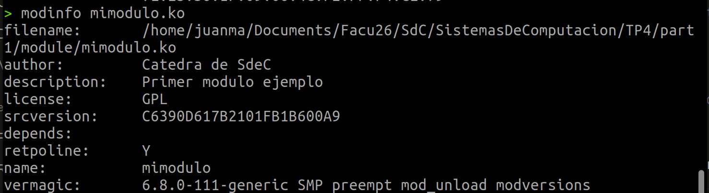

```
modinfo /lib/modules/$(uname -r)/kernel/crypto/des_generic.ko
```

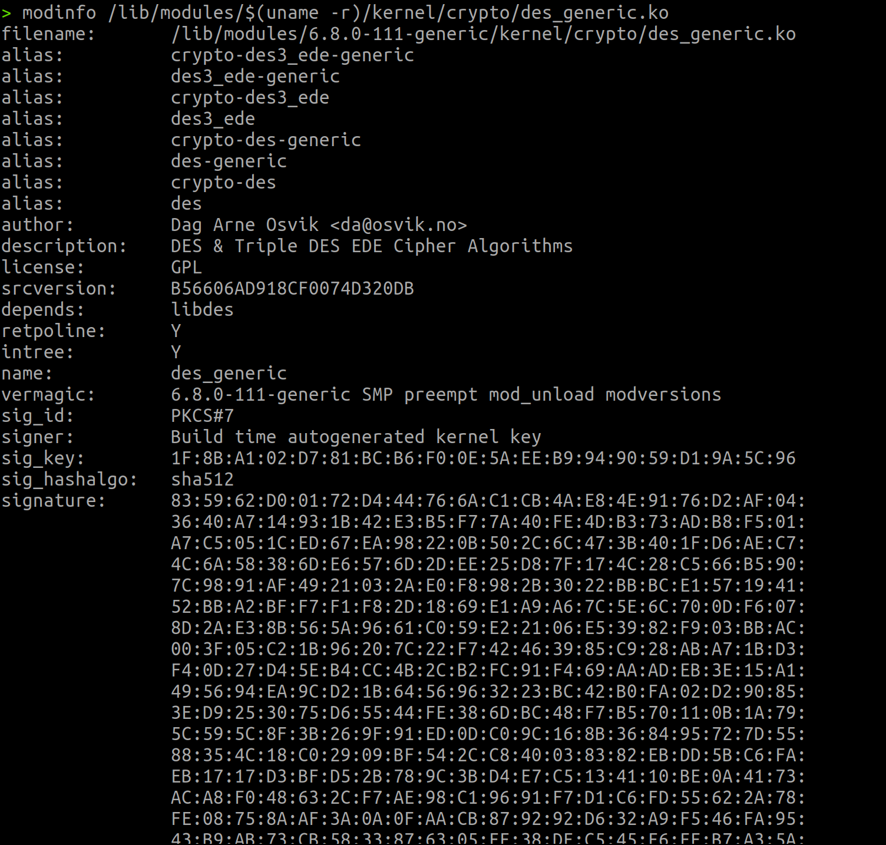

Las principales diferencias son:

Procedencia y trazabilidad

- filename: mimodulo.ko está en /home/juanma/.../TP4/part1/module/ (directorio del usuario, módulo out-of-tree); des_generic.ko está en /lib/modules/6.8.0-111-generic/kernel/crypto/ (árbol oficial del kernel instalado por la distribución).
- intree: presente solo en des_generic.ko con valor Y, indica que es un módulo distribuido con el kernel oficial. mimodulo.ko no tiene este campo.
- alias: des_generic.ko declara 8 aliases (crypto-des, des3_ede, etc.) que udev/modprobe usan para cargarlo automáticamente cuando otro subsistema del kernel requiere el algoritmo DES. mimodulo.ko no declara ninguno porque no representa un servicio o dispositivo invocable.
- depends: des_generic.ko depende de libdes (al cargarse arrastra ese módulo); mimodulo.ko no depende de nada porque solo usa símbolos básicos del kernel (printk).

Firma criptográfica

- sig_id, signer, sig_key, sig_hashalgo, signature: presentes en des_generic.ko (firmado en tiempo de compilación con PKCS#7 + sha512 por la clave oficial del build de Ubuntu) y ausentes en mimodulo.ko.
- Consecuencia práctica: al cargar mimodulo.ko, dmesg reporta module verification failed: signature and/or required key missing - tainting kernel, y en /proc/modules aparece el flag E (unsigned). En un sistema con Secure Boot + lockdown activo, esto haría que el módulo fuera rechazado directamente.

# Punto 2 - ¿Qué divers/modulos estan cargados en sus propias pc?


# Punto 3 - ¿cuales no están cargados pero están disponibles? que pasa cuando el driver de un dispositivo no está disponible.

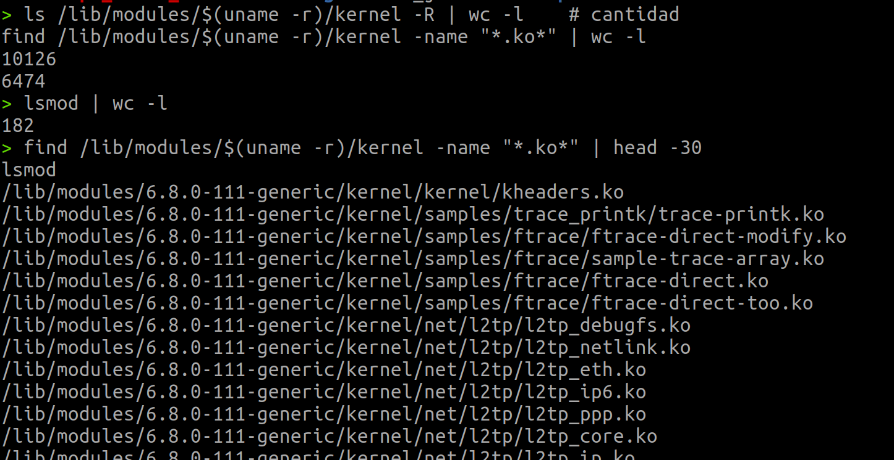

Como se obserba hay 6474 modulos disponibles pero solo 181 modulos cargados, esto se debe a que linux usa carga bajo demanda.
Los modulos que no estan cargados pero suelen estar disponibles son:
- Filesystems exóticos: jfs, reiserfs, ntfs3, f2fs, udf.
- Drivers de hardware que no tengo: drivers de WiFi de otros fabricantes.
- Protocolos de red poco usados: l2tp_*, tipc, batman-adv, can.
- Subsistemas opcionales: mac80211_hwsim, módulos de muestra en samples/ftrace/.

### Que pasa cuando un dirver de un dispositivo no esta disponible?

El dispositivo no funciona en lo absoluto. El kernel detecta la presencia del hardware, se puede ver en ```lspci -k``` como un device sin ```Kernel driver in use:``` pero no se puede comunicar con este.

Otra opcion es que el dispositivo funcione en modo degradado con un driver generico. Muchos subsistemas tienen fallbacks genericos. Por ejemplo, una impresora sin driver especifico puede imprimir via un driver PostScript/PCL generico.

Cuando falta un modulo critico para el arranque del propio sistema, el sistema no arranca, ocurre un kernel panic. Para evitar esto, los módulos esenciales se precargan en el initramfs: una imagen comprimida que el bootloader carga junto con el kernel y que contiene los módulos imprescindibles antes de que el sistema pueda acceder al disco real.

# Punto 4 - Correr hwinfo en una pc real con hw real y agregar la url de la información de hw en el reporte.

```hwinfo --short```

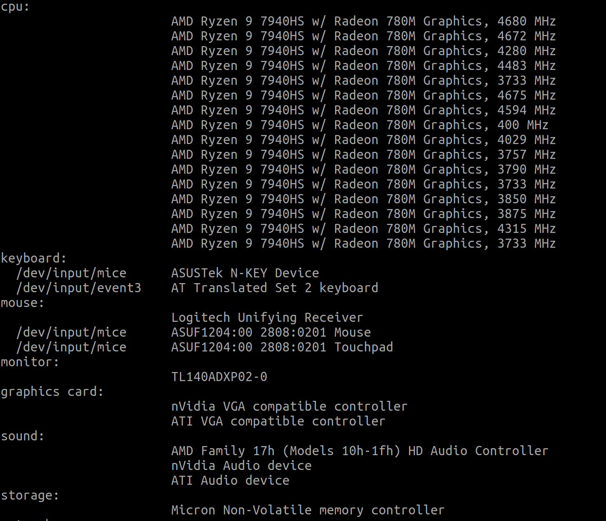
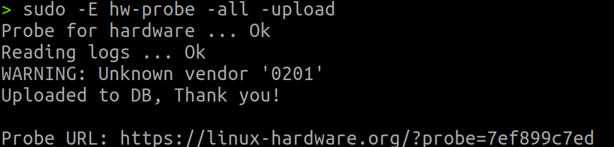

### Link informacion de HW:

https://linux-hardware.org/?probe=7ef899c7ed

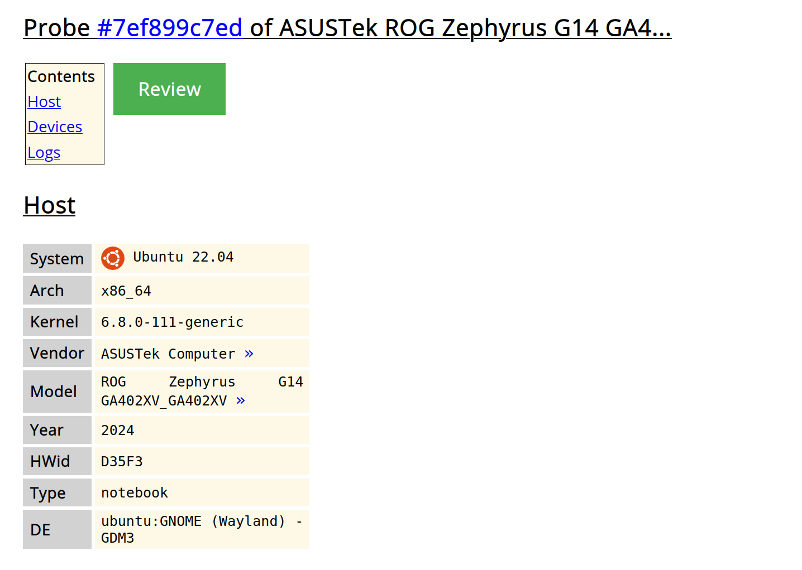

# Punto 5 — ¿Qué diferencia existe entre un módulo y un programa?

Existen tres diferencias fundamentales entre un módulo del kernel y un programa de usuario convencional:

* Espacio de ejecución: los programas se ejecutan como procesos independientes dentro del espacio de usuario (*user space*), el cual tiene permisos restringidos e indirectos. Por el contrario, los módulos operan directamente en el espacio del kernel (*kernel space*), teniendo acceso privilegiado y directo a todos los recursos de hardware y a la memoria física del sistema.
* Propósito y ciclo de vida: mientras que un programa es una aplicación diseñada para cumplir una tarea específica ejecutándose de principio a fin, un módulo es un fragmento de código diseñado para cargarse (ej. `insmod`) y descargarse (ej. `rmmod`) en el kernel de forma dinámica. Su función principal es extender la funcionalidad del sistema operativo sobre la marcha (como agregar un nuevo controlador de dispositivo) sin necesidad de compilar un kernel monolítico inmenso ni tener que reiniciar la máquina.
* Impacto de los errores: en un programa convencional, si se comete un error grave de acceso a memoria, el sistema operativo aísla el fallo, detiene únicamente ese proceso (generando un *segmentation fault*) y el resto del equipo sigue funcionando. En un módulo, al operar en el nivel de máximo privilegio, un error similar (como el uso de un puntero salvaje) no puede ser contenido; puede corromper estructuras de datos críticas de otros procesos, dañar el sistema de archivos o provocar un colapso total del sistema operativo (*Kernel Panic*), lo que obliga a reiniciar físicamente el equipo.

# Punto 6 — ¿Cómo ver las llamadas al sistema que realiza un hello world en C?

Con la herramienta `strace`, que intercepta y muestra todas las syscalls que ejecuta un proceso.

```bash
gcc hello.c -o hello
strace ./hello              # imprime el trace por pantalla
strace -o trace.txt ./hello # guarda el trace en un archivo
strace -c ./hello           # muestra un resumen con conteo de syscalls
```

## Evidencia

Programa usado:

```c
#include <stdio.h>
int main(void) {
    printf("Hola mundo desde TP4\n");
    return 0;
}
```

Resumen obtenido con `strace -c ./hello`:

```
% time     seconds  usecs/call     calls    errors syscall
------ ----------- ----------- --------- --------- ----------------
 22.64    0.000036          12         3           brk
 20.75    0.000033          33         1           write
 17.61    0.000028          28         1           prlimit64
 16.98    0.000027          27         1           munmap
 11.32    0.000018           6         3           fstat
 10.69    0.000017          17         1           getrandom
  0.00    0.000000           0         1           read
  0.00    0.000000           0         2           close
  0.00    0.000000           0         8           mmap
  0.00    0.000000           0         3           mprotect
  0.00    0.000000           0         2           pread64
  0.00    0.000000           0         1         1 access
  0.00    0.000000           0         1           execve
  0.00    0.000000           0         1           arch_prctl
  0.00    0.000000           0         1           set_tid_address
  0.00    0.000000           0         2           openat
  0.00    0.000000           0         1           set_robust_list
  0.00    0.000000           0         1           rseq
------ ----------- ----------- --------- --------- ----------------
100.00    0.000159           4        34         1 total
```

Un simple "hola mundo" generó 34 syscalls, de las cuales sólo una (`write`) corresponde al `printf`. El resto son del cargador dinámico y la inicialización de la libc.

# Punto 7 — ¿Qué es un segmentation fault? ¿Cómo lo maneja el kernel y cómo lo hace un programa?

## ¿Qué es?

Una violación de acceso a memoria: el programa intentó leer o escribir en una dirección virtual a la que no tiene permiso (memoria no mapeada, un puntero `NULL`, una región de sólo lectura, o fuera de los segmentos asignados al proceso).

## Cómo lo maneja el kernel

1. La MMU (hardware del CPU) detecta el acceso ilegal y genera una excepción de tipo *page fault*.
2. El handler de page fault del kernel evalúa si el acceso es legítimo (página válida pero no presente en RAM → la trae del swap) o realmente inválido.
3. Si es inválido, el kernel envía al proceso la señal `SIGSEGV` (signal 11).

## Cómo lo maneja el programa

- Por defecto, el manejador de `SIGSEGV` termina el proceso y genera un *core dump* (si `ulimit -c` lo permite) para depuración con `gdb`.
- El programa puede capturar la señal con `signal()` o `sigaction()` y manejarla, aunque no es buena práctica porque tras un segfault el estado de la memoria queda inconsistente.

## Evidencia

Programa usado:

```c
#include <stdio.h>

int main(void) {
    int *p = NULL;
    printf("Voy a derefenciar un puntero NULL...\n");
    *p = 42;
    printf("Esta linea nunca se ejecuta\n");
    return 0;
}
```

Ejecución:

```
$ ./segfault
Voy a derefenciar un puntero NULL...
Segmentation fault (core dumped)
$ echo "Codigo de salida: $?"
Codigo de salida: 139
```

El código de salida 139 = 128 + 11, donde 11 es el número de `SIGSEGV`. Es la convención de bash para indicar que el proceso fue terminado por una señal.

## Diferencia con un módulo de kernel

Si un módulo del kernel comete un acceso ilegal, no hay un proceso "padre" que lo termine. El resultado es un Kernel Oops (queda registrado en `dmesg` con stack trace y el kernel sigue marcado como *tainted*) o, en casos graves, un Kernel Panic que congela el sistema.

# Punto 8 - ¿Se animan a intentar firmar un módulo de kernel ? y documentar el proceso ? 

#### 1. Verificación de herramientas

Se confirmó la disponibilidad de `openssl` y del script `sign-file` provisto por las fuentes del kernel:

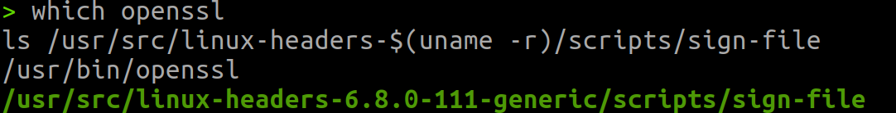

#### 2. Generación del par de claves

Se generó un par RSA de 2048 bits con un certificado X.509 autofirmado en formato DER:

```bash
openssl req -new -x509 -newkey rsa:2048 \
    -keyout MOK.priv \
    -outform DER -out MOK.der \
    -nodes -days 36500 \
    -subj "/CN=Claudes Interns Module Signing/"
chmod 600 MOK.priv
```

Detalle de los flags más relevantes:

- `-x509`: genera un certificado autofirmado (no requiere CA externa).
- `-newkey rsa:2048`: genera además un par de claves RSA de 2048 bits.
- `-outform DER`: el certificado se exporta en formato binario DER.
- `-nodes`: la clave privada no se encripta con passphrase (caso contrario, habría que tipearla cada vez que se firme un módulo).
- `-days 36500`: validez de 100 años.
- `-subj "/CN=..."`: *Common Name* del certificado, que aparecerá luego en el campo `signer:` de `modinfo`.

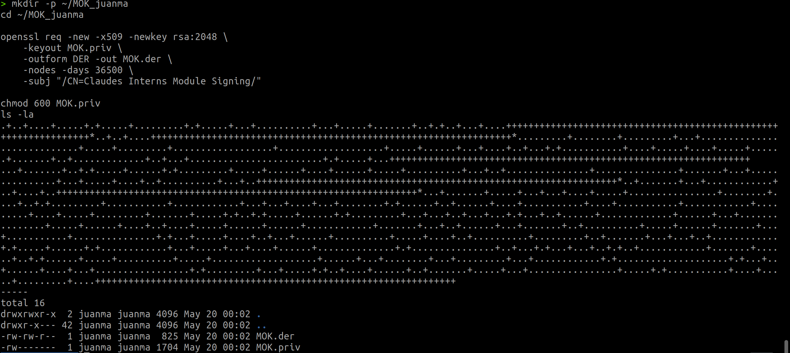

Se generaron los dos archivos esperados: `MOK.priv` (clave privada, 1704 bytes, permisos `600`) y `MOK.der` (certificado público, 825 bytes).

#### 3. Inspección del certificado generado

```bash
openssl x509 -inform DER -in MOK.der -text -noout | head -15
```

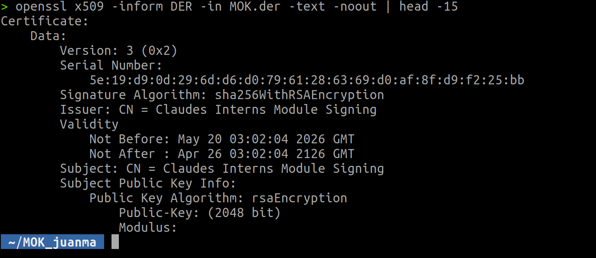

El certificado tiene Subject `CN = Claudes Interns Module Signing`, algoritmo de firma `sha256WithRSAEncryption`, clave pública RSA de 2048 bits, y un Serial Number (`5e:19:d9:0d:29:6d:d6:d0:79:61:28:63:69:d0:af:8f:d9:f2:25:bb`) que más adelante se observará reflejado en el `sig_key` del módulo firmado.

#### 4. `modinfo` ANTES de firmar

Antes de aplicar la firma, los metadatos del módulo solo contienen los campos declarados mediante las macros `MODULE_*` del fuente:

```bash
modinfo mimodulo.ko
```

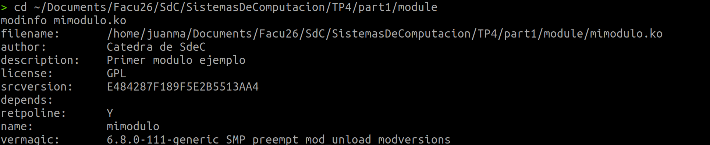

No aparece ningún campo `sig_*`. El módulo está sin firmar.

#### 5. Firma del módulo

Se firmó el módulo con `sign-file`, usando SHA-256 como algoritmo de hash:

```bash
KERNEL=$(uname -r)

sudo /usr/src/linux-headers-$KERNEL/scripts/sign-file \
    sha256 \
    ~/MOK_juanma/MOK.priv \
    ~/MOK_juanma/MOK.der \
    mimodulo.ko
```

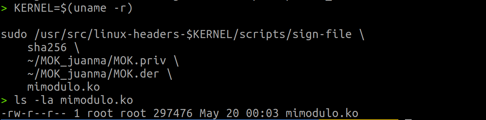

`sign-file` no produce salida si todo sale bien. El archivo `mimodulo.ko` ahora pesa 297476 bytes (creció respecto al original; la firma se appendea al final del archivo).

#### 6. Verificación del magic marker

```bash
tail -c 50 mimodulo.ko | strings
```

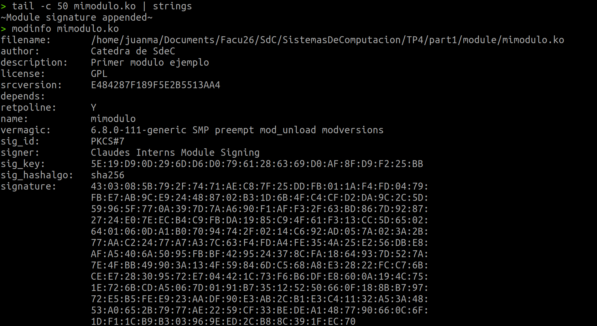

Aparece la cadena `~Module signature appended~`, que es el marcador que el kernel busca al final del archivo para detectar si tiene firma adjunta. La firma **no se incrusta dentro del ELF**: queda como un blob PKCS#7 al final del archivo, precedido por este marcador.

#### 7. `modinfo` DESPUÉS de firmar

```bash
modinfo mimodulo.ko
```


Aparecen los campos correspondientes a la firma:

- **`sig_id: PKCS#7`**: formato del bloque de firma (estándar criptográfico para firmas sobre datos arbitrarios).
- **`signer: Claudes Interns Module Signing`**: *Common Name* del certificado firmante.
- **`sig_key: 5E:19:D9:0D:29:6D:D6:D0:79:61:28:63:69:D0:AF:8F:D9:F2:25:BB`**: identificador de la clave, que coincide exactamente con el Serial Number del certificado generado en el paso 3.
- **`sig_hashalgo: sha256`**: algoritmo usado para calcular el hash del módulo antes de firmarlo.
- **`signature: 43:03:08:5B:...`**: bloque RSA de 256 bytes (2048 bits) con la firma propiamente dicha.

#### 8. Carga del módulo firmado y observación

```bash
sudo rmmod mimodulo 2>/dev/null
sudo insmod mimodulo.ko
sudo dmesg | tail -5
```

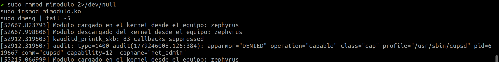

El módulo cargó correctamente. El `printk` del `_init` se ejecutó en kernel space:

```
Modulo cargado en el kernel desde el equipo: zephyrus
```

### Análisis y limitación observada

A pesar de la firma válida, el kernel no la reconoce como "confiable". La evidencia:

```
$ cat /proc/sys/kernel/tainted
12288

$ sudo cat /proc/modules | grep mimodulo
mimodulo 12288 0 - Live 0xffffffffc2568000 (OE)
```

El valor `12288 = 0x3000` corresponde a los bits 12 (`E` — unsigned module) y 13 (`O` — out-of-tree). Las flags `(OE)` en `/proc/modules` confirman lo mismo: el kernel considera al módulo como tainted por estar fuera del árbol oficial **y** por no tener una firma confiable, aunque criptográficamente el módulo sí esté firmado.

La causa se evidencia inspeccionando los keyrings del kernel:

```bash
sudo cat /proc/keys | grep -i "Signing"
```

Solo aparecen las claves de Canonical Ltd. (Secure Boot Signing, Kernel Module Signing, Live Patch Signing). Mi certificado autofirmado no aparece en ningún keyring confiable.

La razón es que mi sistema tiene **Secure Boot deshabilitado** (`mokutil --sb-state` reporta `SecureBoot disabled`). Sin Secure Boot + shim activos durante el arranque, el mecanismo de enrolment vía `mokutil --import` no surte efecto sobre el keyring del kernel: aunque la clave quede registrada en el firmware, no se incorpora al keyring `.machine` o `.platform_keys` desde donde el kernel verifica las firmas.

**Conclusión:** la firma criptográfica del módulo es matemáticamente válida (cualquier sistema con `MOK.der` puede verificar que efectivamente fue firmado con la clave correspondiente), pero su aceptación como firma "confiable" es una **decisión local de cada kernel**, basada en qué claves tiene enroladas.


# Punto 9 - Agregar evidencia de la compilación, carga y descarga de su propio módulo imprimiendo el nombre del equipo en los registros del kernel. 

### Modificación del fuente

Se agregaron tres cambios mínimos a `mimodulo.c`:

1. Include `<linux/utsname.h>` para acceder a `utsname()`.
2. Argumento `%s` con `utsname()->nodename` en el `printk` de carga.
3. Lo mismo en el `printk` de descarga.

```c
#include <linux/module.h>   /* Requerido por todos los módulos */
#include <linux/kernel.h>   /* Definición de KERN_INFO */
#include <linux/utsname.h>  /* Para acceder al hostname vía utsname() */

MODULE_LICENSE("GPL");
MODULE_DESCRIPTION("Primer modulo ejemplo");
MODULE_AUTHOR("Catedra de SdeC");

int modulo_lin_init(void)
{
    printk(KERN_INFO "Modulo cargado en el kernel desde el equipo: %s\n",
           utsname()->nodename);
    return 0;
}

void modulo_lin_clean(void)
{
    printk(KERN_INFO "Modulo descargado del kernel desde el equipo: %s\n",
           utsname()->nodename);
}

module_init(modulo_lin_init);
module_exit(modulo_lin_clean);
```

`utsname()` es un símbolo exportado del kernel que devuelve la misma estructura que la syscall `uname()` expone a user space. Un módulo no puede usar `gethostname()` de glibc porque vive en kernel space y no se enlaza contra libc.

### Compilación

```bash
make clean && make
```

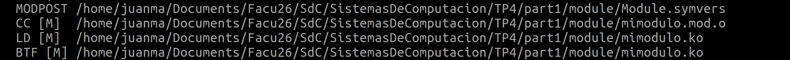

Se generaron correctamente `mimodulo.o`, `mimodulo.mod.o` y `mimodulo.ko`.

### Carga y descarga

```bash
sudo insmod mimodulo.ko
sudo dmesg | tail -5
sudo rmmod mimodulo
```

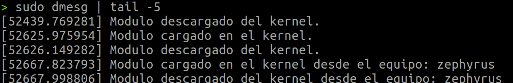

Las dos últimas líneas del ring buffer muestran el módulo modificado en acción:

```
[52667.823793] Modulo cargado en el kernel desde el equipo: zephyrus
[52667.998806] Modulo descargado del kernel desde el equipo: zephyrus
```

El hostname `zephyrus` fue obtenido desde dentro del kernel mediante `utsname()->nodename`, y coincide con la salida de `hostname` y `uname -n` en user space. Las líneas anteriores en la captura corresponden a cargas previas del módulo sin la modificación, lo que permite ver el contraste antes/después.

# Punto 10 - ¿Que pasa si mi compañero con secure boot habilitado intenta cargar un módulo firmado por mi? 

**El módulo será rechazado por el kernel de mi compañero.**

Al intentar cargarlo verá:

```
insmod: ERROR: could not insert module mimodulo.ko: Key was rejected by service
```

Y en `dmesg`:

```
PKCS#7 signature not signed with a trusted key
mimodulo: Loading of module with unavailable key is rejected
```

### Por qué

Cuando el kernel verifica una firma, busca la clave pública del firmante en sus *keyrings* confiables:

- `.builtin_trusted_keys`: claves del fabricante de la distro (Canonical en Ubuntu).
- `.platform_keys`: claves del firmware UEFI.
- `.machine` (MOK): claves enroladas por el usuario vía `mokutil`.

Mi `MOK.der` está en *mi* keyring, no en el de mi compañero. Aunque la firma sea matemáticamente válida (su kernel podría verificar con mi clave pública que efectivamente fui yo quien firmó), el kernel no la reconoce como confiable porque la clave no está enrolada localmente. Con Secure Boot activo y `sig_enforce=1`, esto equivale a rechazo directo (no solo `taint`).

### Cómo podría aceptarlo

Mi compañero debería:

1. Recibir mi `MOK.der` (la **pública**; nunca `MOK.priv`).
2. `sudo mokutil --import MOK.der`.
3. Reiniciar y confirmar el enroll en la pantalla azul de MOK Manager.

Recién entonces su kernel confiaría en módulos firmados por mí.

# Punto 11 — Artículo de Ars Technica sobre el parche de Microsoft y GRUB

> Referencia: https://arstechnica.com/security/2024/08/a-patch-microsoft-spent-2-years-preparing-is-making-a-mess-for-some-linux-users/

## 11.a) ¿Cuál fue la consecuencia principal del parche de Microsoft sobre GRUB en sistemas con arranque dual?

En el Patch Tuesday de agosto de 2024, Microsoft distribuyó una actualización SBAT (Secure Boot Advanced Targeting) destinada a mitigar la vulnerabilidad CVE-2022-2601, un *buffer overflow* en GRUB2 que permitía bypassear Secure Boot.

Microsoft anunció que el parche no se aplicaría a equipos con arranque dual, pero el mecanismo de detección de dual-boot falló, y la actualización se instaló en muchas máquinas con Windows + Linux. Como consecuencia, esos equipos no podían iniciar Linux, mostrando el error:

```
Verifying shim SBAT data failed: Security Policy Violation.
Something has gone seriously wrong: SBAT self-check failed: Security Policy Violation.
```

Afectó a las principales distribuciones (Ubuntu, Linux Mint, Debian, Zorin OS, Puppy Linux, entre otras). Microsoft tardó hasta mayo de 2025 en lanzar la solución definitiva.

## 11.b) ¿Qué implicancia tiene desactivar Secure Boot como solución al problema?

Si bien desactivar Secure Boot permite evadir la restricción del parche y volver a arrancar Linux, la implicancia directa es una degradación crítica en la seguridad del equipo. Al apagar esta característica, se elimina la barrera defensiva previa a la carga del sistema operativo, dejando a la computadora vulnerable frente a la ejecución de código no autorizado o malware avanzado (como bootkits y rootkits) que opera desde las capas más profundas del hardware.

## 11.c) ¿Cuál es el propósito principal del Secure Boot en el proceso de arranque?

Secure Boot es una característica del firmware UEFI cuyo objetivo es garantizar que sólo se ejecute durante el arranque código firmado digitalmente por una autoridad de confianza. Establece una cadena de verificación criptográfica: el firmware verifica el bootloader, el bootloader verifica el kernel, y el kernel verifica los módulos.

Su propósito es proteger contra bootkits, rootkits y malware persistente que intenten ejecutarse antes de que el sistema operativo y sus defensas (antivirus, EDR) tengan oportunidad de cargarse.

# Desafío #1

## ¿Qué es checkinstall y para qué sirve?

`checkinstall` es una herramienta que envuelve la instalación de software compilado desde fuentes (`make install`) y, en lugar de copiar archivos sueltos al sistema, genera un paquete nativo del distribuidor (`.deb` en Debian/Ubuntu, `.rpm` en Red Hat/Fedora, `.tgz` en Slackware). Esto permite:

- Registrar la instalación en el gestor de paquetes del sistema (`dpkg -l`, `rpm -qa`).
- Desinstalar limpiamente con `dpkg -r` o `rpm -e`.
- Distribuir el paquete a otras máquinas.
- Asociar metadatos (versión, mantenedor, dependencias, licencia) al software.

Sin `checkinstall`, los archivos copiados por `make install` quedan dispersos y son difíciles de remover de forma confiable.

## Empaquetado de un hello world

### Programa y Makefile

```c
// hello.c
#include <stdio.h>
int main(void) {
    printf("Hola mundo - empaquetado con checkinstall - TP4\n");
    return 0;
}
```

```makefile
# Makefile
PREFIX ?= /usr/local

hello: hello.c
	gcc -o hello hello.c

install: hello
	install -D -m 755 hello $(DESTDIR)$(PREFIX)/bin/hello

clean:
	rm -f hello
```

### Procedimiento

```bash
make
sudo checkinstall --pkgname=hello-tp4 --pkgversion=1.0 --backup=no --default
```

### Salida de checkinstall (relevante)

```
**** Debian package creation selected ***

This package will be built according to these values:

0 -  Maintainer: [ root@Luca ]
1 -  Summary: [ Package created with checkinstall 1.6.3 ]
2 -  Name:    [ hello-tp4 ]
3 -  Version: [ 1.0 ]
4 -  Release: [ 1 ]
5 -  License: [ GPL ]
...

========================= Installation results ===========================
install -D -m 755 hello /usr/local/bin/hello

======================== Installation successful ==========================

Copying files to the temporary directory...OK
Stripping ELF binaries and libraries...OK
Building Debian package...OK
Installing Debian package...OK

Done. The new package has been installed and saved to
/home/esqueletinho/tp4/desafio1/hello-tp4_1.0-1_amd64.deb
```

### Verificación

```
$ ls -lh *.deb
-rw-r--r-- 1 root root 2.1K May 19 23:05 hello-tp4_1.0-1_amd64.deb

$ dpkg -l | grep hello-tp4
ii  hello-tp4    1.0-1    amd64    Package created with checkinstall 1.6.3

$ which hello
/usr/local/bin/hello

$ hello
Hola mundo - empaquetado con checkinstall - TP4
```

### Desinstalación

```
$ sudo dpkg -r hello-tp4
Removing hello-tp4 (1.0-1) ...

$ which hello
(sin salida → ya no está en el sistema)
```

El paquete `.deb` queda incluido en el repositorio del grupo como evidencia.

---

## Seguridad del kernel: evitar cargar módulos no firmados y rootkits

### ¿Qué es un rootkit?

Un rootkit es software malicioso diseñado para obtener y mantener acceso privilegiado a un sistema ocultando su presencia. Los más peligrosos son los de nivel kernel, que se cargan como módulos (LKM) y, al ejecutarse en ring 0, pueden modificar las estructuras internas del sistema operativo para esconder sus propios procesos, archivos, conexiones de red y módulos del listado de `lsmod`. Resultan casi indetectables desde el espacio de usuario porque son ellos mismos los que responden a las consultas.

### Defensa: exigir firma de módulos

Linux permite rechazar cualquier módulo que no esté firmado con una clave en la que el kernel confíe. La defensa combina cuatro capas:

1. Secure Boot activo en UEFI: establece la cadena de confianza desde el firmware → bootloader → kernel.
2. Parámetro de arranque `module.sig_enforce=1`: hace que el kernel rechace cualquier módulo sin firma válida, incluso si lo intenta cargar root.
3. `lockdown=confidentiality` o `integrity`: restringe operaciones de root que podrían modificar el kernel en runtime (acceso a `/dev/mem`, `kexec`, escritura a registros MSR, etc.).
4. Claves confiables: las del distribuidor (Canonical, Red Hat) y las MOK (Machine Owner Keys) importadas por el usuario con `mokutil --import`.

Verificación de que la protección está activa:

```bash
cat /sys/module/module/parameters/sig_enforce   # debería decir Y
cat /sys/kernel/security/lockdown               # modo activo entre [ ]
```

Con esta configuración, ni un atacante con privilegios de root puede cargar un módulo malicioso, lo que dificulta enormemente desplegar un rootkit a nivel kernel. La única vía sería romper Secure Boot o reemplazar el firmware, lo cual eleva drásticamente la barrera técnica del ataque.

# Desafío #2

## ¿Qué funciones tiene disponibles un programa y un módulo?

Un programa de usuario dispone de:

- La librería estándar de C (libc): `printf`, `scanf`, `malloc`/`free`, `fopen`, `strcpy`, etc.
- La API POSIX: `open`, `read`, `write`, `fork`, `exec`, `pipe`, `mmap`, hilos POSIX, señales, etc.
- Cualquier librería externa enlazada (OpenSSL, SDL, GTK, Qt, libcurl, ...).
- Para acceder al hardware o a recursos del sistema usa llamadas al sistema (~400 en Linux), que son la única vía hacia el kernel.

Un módulo del kernel no tiene libc ni POSIX. Sólo dispone de la API interna del kernel, incluida desde headers como `<linux/module.h>`, `<linux/kernel.h>`, `<linux/slab.h>`. Funciones más comunes:

- `printk()` para imprimir al buffer del kernel (visible con `dmesg`).
- `kmalloc()` / `kfree()` para memoria dinámica del kernel.
- `copy_to_user()` / `copy_from_user()` para transferir datos entre kernel y usuario.
- `register_chrdev()`, `register_blkdev()` para registrar dispositivos.
- `request_irq()` para manejar interrupciones de hardware.
- Primitivas de sincronización: `mutex_lock()`, `spin_lock()`, semáforos.

## Espacio de usuario o espacio del kernel

Linux divide la memoria virtual y los privilegios en dos zonas:

| | Espacio de usuario | Espacio del kernel |
|---|---|---|
| Privilegio CPU | Ring 3 (x86) | Ring 0 (x86) |
| Acceso a hardware | Indirecto, vía syscalls | Directo y total |
| Memoria visible | Solo la del propio proceso | Toda la RAM |
| Si falla | Muere el proceso (SIGSEGV) | Kernel Oops / Panic |
| Ejemplos | Firefox, bash, gcc | Drivers, scheduler, FS |

El paso de un espacio al otro se da por tres mecanismos:
- Syscalls: el proceso solicita un servicio al kernel.
- Interrupciones: el hardware pide atención.
- Excepciones: errores como page faults o división por cero.

## Espacio de datos

Cuando un programa se ejecuta, su memoria virtual se organiza en segmentos:

- Text: código ejecutable, sólo lectura.
- Data: variables globales/estáticas inicializadas (`int x = 5;`).
- BSS: variables globales/estáticas no inicializadas (se ponen a cero al cargarse).
- Heap: memoria dinámica con `malloc`. Crece hacia arriba.
- Stack: variables locales, parámetros, direcciones de retorno. Crece hacia abajo.
- Memoria mapeada: librerías compartidas, archivos abiertos con `mmap`.

En el kernel, esta organización no es la misma: el módulo se carga en una zona reservada y comparte el espacio con el resto del kernel. Las direcciones virtuales del kernel no son las mismas que las de los procesos, por eso para transferir datos entre ambos espacios hay que usar `copy_to_user()` / `copy_from_user()` y nunca derefenciar punteros de usuario directamente desde el kernel.

## Drivers e investigación de `/dev`

En Linux todo es un archivo: los dispositivos se exponen como entradas en `/dev`, y los programas interactúan con ellos usando las syscalls habituales (`open`, `read`, `write`, `ioctl`).

Cada entrada en `/dev` tiene:
- Tipo: `c` (carácter, byte a byte: teclados, terminales) o `b` (bloque, en bloques fijos: discos).
- Major number: identifica qué driver maneja el dispositivo.
- Minor number: identifica la instancia concreta dentro del driver.

Ejemplo:

```
$ ls -l /dev/sda /dev/null /dev/tty
brw-rw---- 1 root disk    8, 0  /dev/sda     (b = bloque, major 8 = SCSI/SATA)
crw-rw-rw- 1 root root    1, 3  /dev/null    (c = caracter, major 1 minor 3)
crw-rw-rw- 1 root tty     5, 0  /dev/tty     (c = caracter, major 5 minor 0)
```

Ejemplos típicos:
- `/dev/null` → descarta toda escritura.
- `/dev/zero` → produce bytes en cero infinitamente.
- `/dev/random`, `/dev/urandom` → generadores aleatorios.
- `/dev/sda`, `/dev/sda1` → disco SATA y su primera partición.
- `/dev/tty`, `/dev/pts/*` → terminales.
- `/dev/input/event*` → eventos de teclado, mouse, joystick.

Un driver es el software que permite al kernel comunicarse con un dispositivo de hardware específico. Cuando se desarrolla uno nuevo, generalmente se implementa como módulo del kernel que se registra ante el subsistema correspondiente y crea su nodo en `/dev`. Así los programas de usuario pueden abrirlo y hablar con el hardware vía syscalls estándar.
